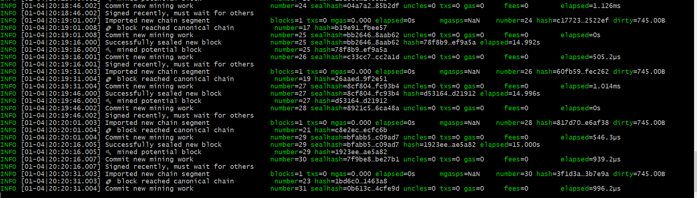
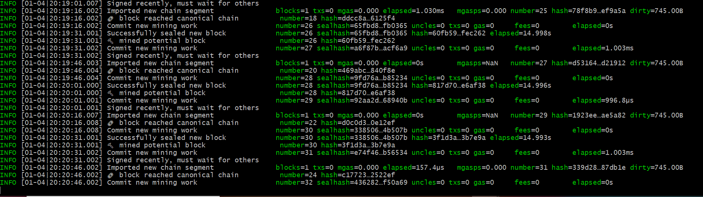
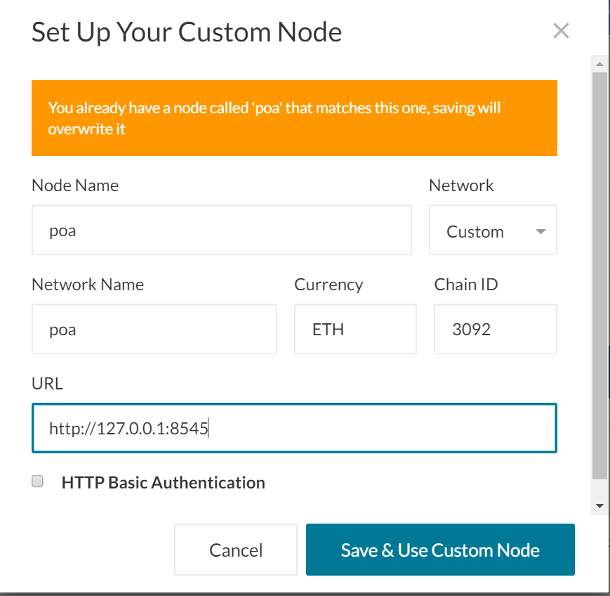
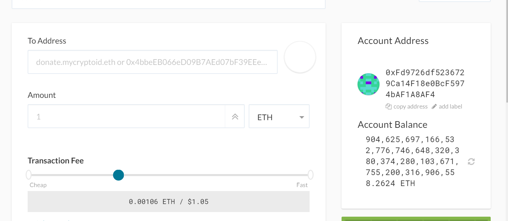
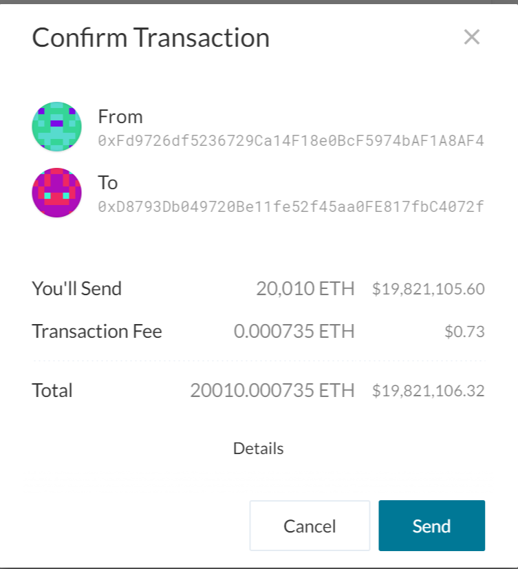
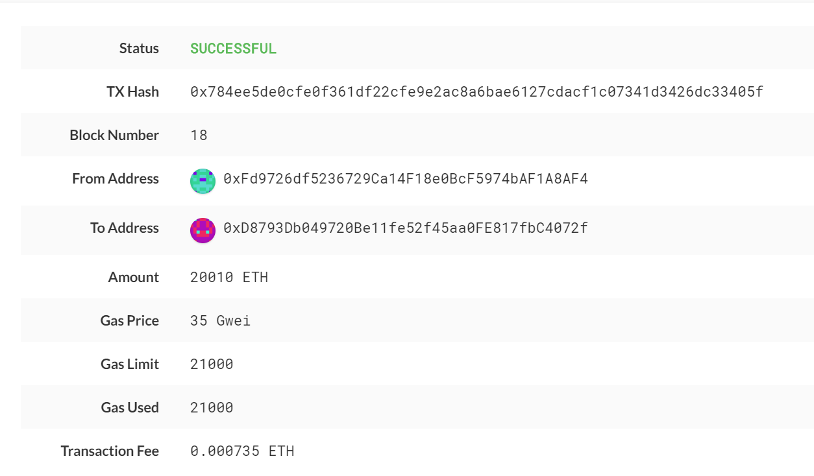
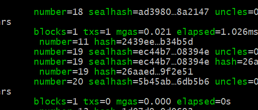

# Proof of Authority Block Chain

Among different types of blockchain algorithms, Proof of Authority uses comparitively less number of nodes, as the nodes are picked by authority.

For this project, the client is bank and the purpose is to explore what advantages can a block chain bring to the bank and its customers. Proof of Authority type block chain is picked for this purpose.

Process of creating and running a block chain:

1. Select the algorithm type

2. Create genesis block

3. create nodes (In this case 2)

4. Initialize the nodes and link them together

After the block chain is up and running, it can be tested by making a transaction using Mycrypto.

Procedural steps:

1. Create accounts for nodes 1 and 2. This will produce account addresses that will be used as nodal addresses while initializing the nodes.

2. Select the appropriate algorithm and create genesis block. (This block includes declaring details of network name, network id, seal addresses and pre funding addresses)

3. Downloaad json files relating to the nodes created.

4. Initialize the nodes

5. Start mining the nodes. The nodes start mining only after they are linked. That means, only after they can find the peers. There can be any number of peers(nodes). The nodes are linked using the enode address from one node to all the other nodes.

6. Testing the mining. For this purpose, Mycrypto app is used. A custom network is created with the similar name of what was gicen while creating genesis block. The network id is also the same number given while creating genesis block.

7. After the custom network node is created, the network is changed to block chain network.

8. When the wallet is opened using the keystore file generates for the node1, test ETH of huge amounts can be seen populated.

9. For testing purposes, a sample transaction can be made to any address. Transaction status can be checked in the transaction tab.

10. Check the nodes if the transaction is mined and block is created.

Things to bear in mind while creating block chain:

1. Selecting the wait time before mining. This will change how quickly the transactions are mined.

2. Creating the custom node with appropriate attributes and host.

3. Network linking in the application is crucial for blockchain to pick up the transaction and mine it.

4. Fee/gas used for the transaction plays important role, depending on the type of the algorithm used.